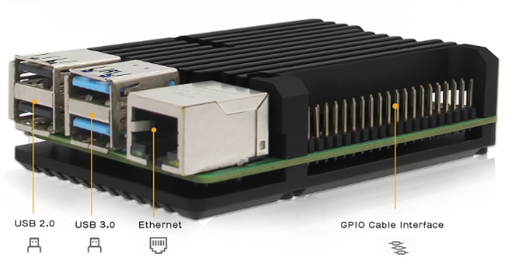
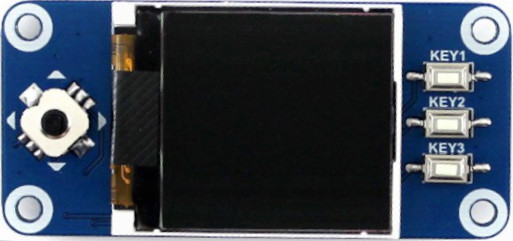

# Pi Dream Machine (pireveil)
Raspberry Pi Dream machine : French version on my blog : <a href='https://blog-info.cd-ii.fr/un-radio-reveil-a-base-de-raspiberry-pi/'>https://blog-info.cd-ii.fr/un-radio-reveil-a-base-de-raspiberry-pi/</a>
  

Building a dream machine using a Raspberry Pi

  

# What do you need ?
<ul>
<li>A raspberry Pi (you can choose : Pi Zero, 1, 2, 3, 4 but NOT Pi 5 !) with an internet connexion (Ethernet or Wifi) 
The Raspberry Pi 5 use different hardware and can not be used with the RPi.GPIO library.
Mine is a Raspberry Pi2 with a Wifi USB dongle and a silent cooling box like this  

</li>
<li>An Oled screen 128x128 pixels with 3 buttons and 1 joypad (from Waveshare)  

</li>
<li>Raspberry OS Lite (no need for Desktop) 
</li>
<li>External speakers</li>
</ul>

# What do you have to know before ?
<ul>
<li>How to begin with a Rapsberry Pi (using a SD Card, installing the OS)</li>
<li>How to launch commands via Terminal or ssh client</li>
</ul>

# What these dream machine can do  ?
<ul>
<li>Shows current date and time</li>
<li>Lets you set an alarm</li>
<li>Lets you choose what the Pi will play to wake you up</li>
<li>Lets you choose between some sound samples, mp3, m3u, web radio to listen now or to be used to wake you up</li>
<li>Automatic font color change (day/night) to reduce brightness</li>
</ul>

# What technologies does it use  ?
<ul>
<li>Python 3</li>
<li>Systemctl service setting</li>
<li>Internet web radio streaming</li>
</ul>

# What will you find on the repository  ?
<ul>
<li>Alarme directory : some mp3 files you can use to wake you up
    <ul>
    <li>beep.mp3 : a simple beep sound</li>
    <li>incendie.mp3 : a fire alarm sound</li>
    <li>coq.mp3 : a rooster crowing sound</li>
    </ul>
</li> 
<li>Musique directory
    <ul>
    <li>You have to put your favorites mp3 songs here</li>
    </ul>
</li>   
<li>root directory
    <ul>
    <li>alarmelist.json : a json file that describes which alarm sounds you can choose (mp3 files must exist in alarme directory)</li>
    <li>audio.json : a json file that describes which mp3 or m3u files you can choose (mp3 and m3u files must exist in musique directory). 
    I put my personnal audio list here but can't include it due to copyright reasons</li>
    <li>create_m3u.sh : a simple shell script that helps you create your own m3u files</li>
    <li>installpackage.sh : a simple shell script that will install all packages and libraries you need</li>
    <li>installsertvice.sh : a simple shell script that will install the service to make PiReveil start each time the Pi is rebooted. <b>Be careful</b> : it assumes that everything is in /home/pi/pireveil/. If not, you will have to change it</li>
    <li>key_demo.py : a short script included with the screen when you bought it that helps you test the screen and the buttons</li>
    <li>LCD_1in44.py and LCD_Config.py : Essential libraries to control the screen</li>
    <li>main.py : a short script included with the screen when you bought it that demonstrates the screen's capabilities</li>
    <li>param.ini : Dream machine parameters</li>
    <li>tools.py : Some very simple commun functions</li>
    <li>pireveil.py : the PiReveil software</li>
    <li>server.py : the PiReveil http service software</li>
    <li>pireveil.service : the PiReveil description service file for systemctl <b>Be careful</b> Open it and change the directories path in the script if necessary</li>
    <li>httpreveil.service : the PiReveil http description service file for systemctl <b>Be careful</b> Open it and change the directories path in the script if necessary</li>
    <li>play.py : A very simple python script used by pireveil.py to play mp3 or m3u files and radio streaming</li>
    <li>radiolist.json : a json file that describes and list some webradios (make your own with your favorite editor)</li>
    <li>base.html, style.css, tools.js : files to build the http server web page</li>
    <li>time.bmp : An image that pireveil will show while starting</li>
    </ul>
</li> 
</ul>

# param.ini description :
Opening this text file you will see variables and values
<ul>
<li>alarme section: Here, pireveil.py will load and save your parameters (alarm clock, what to do to wake you up)</li>
<li>audio section: What file will be played if you ask to listen to it. index values corresponds to json files</li>
<li>click section: Short : set the minimum click time for a short click (in ms)</li>
<li>click section: Long : same but for a long click (in ms)</li>
<li>color section: d is for day, n is for night, font_1 is for big font text, font_2 is for small font text, ico is for icons</li>
<li>color section: day_start and day_end are times to make pireveil choose between "d" or "n" font color</li>
</ul>   

Using the buttons, pireveil.py will change and save alarme and audio sections
If you want to change click or color settings, you will have to open param.ini and change their values.

# How to install
<ul>
<li>Run "sudo bash installpackage.sh" in the console</li>
<li>Check your screen and your buttons with python3 main.py and python3 key_demo.py</li>
<li>Launch pireveil.py to check if it works</li>
<li>Put some mp3 files in the musique folder and change audiolist.json content</li>
<li>Launch pireveil.py again to check if it works</li>
<li>Open installservice.sh and pireveil.service to use the folder where you have installed PiReveil</li>
<li>Run "sudo bash installservice.sh"</li>
<li>Run "sudo systemctl start pireveil.service"</li>
<li>Run "sudo systemctl status pireveil.service". If it's ok then it's done !</li>
</ul> 

# How to use the screens
<b>PiReveil can show 2 differents screens</b>
The first one is the main, it shows :
<ul>
<li>
If it's playing something : a play icon
</li>
<li>
3 icons : for beeping, listening to the radio and listening to mp3 or m3u files. A red icon indicates the alarm is on and which type of media will be played to wake you up.
</li>
<li>
Current time
</li>
<li>
Current date
</li>
<li>
Current alarm time and what PiReveil will do (radio stations' name, mp3 or m3u name or beep file name)
</li>
<li>
If you have set a media to listen to now, you can play it by pushing the corresponding button (radio stations name , mp3 name or beep file name)
</li>
</ul>

<b>The second is the alarmclock seetings, it shows :</b>
<ul>
<li>
If it's playing someting : a play icon
</li>
<li>
3 icons : for beeping, listening to the radio and listening to mp3 or m3u files. A red icon indicates the alarm is on and which type of media will be played to wake you up.
</li>
<li>
Current alarm time and a red cursor that indicates what digit you can change now
</li>
</ul>

# How to use the buttons
<b>On the main screen :</b>
<ul>
<li>K1 short click : cycle to the next beep sound until it shows none are selected then pressing it again will come back to the first</li>
<li>K2 short click : cycle to the next radio station sound until it shows none are selected then pressing it again will come back to the first</li>
<li>K3 short click : cycle to the next mp3/m3u file sound until it shows none are selected then pressing it again will come back to the first</li>
<li>K1 long click : start/stop listening to the selected beep file</li>
<li>K2 long click : start/stop listening to the selected radio station</li>
<li>K3 long click : start/stop listening to the selected mp3 or m3u file</li>
<li>Joypad short press : stop listening to whatever the source is (Ex : it stops the alarm as well as the radio, mp3/m3u files, or beep files)</li>
<li>Joypad long press : Arming alarm with audio source selected</li>
<li>Joypad long UP : Go to alarm screen</li>
</ul>

<b>On the alarm screen :</b>
<ul>
<li>K1 short click : cycle to the next beep sound to play as the alarm until it shows none are selected then pressing it again will come back to the first</li>
<li>K2 short click : cycle to the next radio station to play as the alarm until it shows none are selected then pressing it again will come back to the first</li>
<li>K3 short click : cycle to the next mp3/m3u file to play as the alarm until it shows none are selected then pressing it again will come back to the first</li>
<li>Joypad short press : Skip to the next digit to modify on the alarm</li>
<li>Joypad short left : decrease selected digit</li>
<li>Joypad short right : increase selected digit</li>
<li>Joypad long UP : Return to main screen</li>
</ul>

# Using the httpserver
By default, it use the http standard port (80)
In this case, use the raspbérry's Ip ex : http://192.168.1.15 if 192.168.1.15 is the raspberry's ip
You can use your smartphone, PC or what ever you want
Then you ville see this page, that allows you to change some parameters

